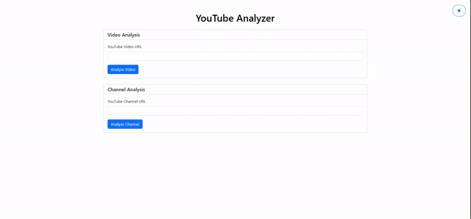
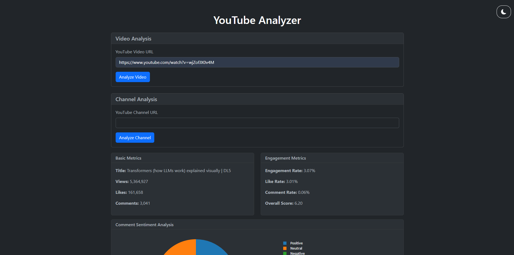

# YouTube Analyzer

YouTube Analyzer is a Flask-based web application designed to provide detailed insights into YouTube videos and channels. By leveraging the YouTube Data API v3, this tool fetches real-time data and processes it to deliver valuable analytics, including basic video statistics, engagement metrics, sentiment analysis of comments, and channel performance trends. With interactive visualizations powered by Plotly, users can easily interpret data and make informed decisions.



## Features

### Video Analysis
- Basic Metrics (views, likes, comments)
- Engagement Metrics (engagement rate, like rate, comment rate)
- Comment Sentiment Analysis with visualization
- Recent Comments Display
- Overall Performance Score

### Channel Analysis
- Channel Overview (subscribers, total videos, total views)
- Upload Frequency Analysis
- Performance Trends Visualization
- Top Performing Videos List

## Technologies Used

- Backend:
  - Python 3.8+
  - Flask 2.0.3
  - Google YouTube API v3
  - TextBlob for sentiment analysis
  - Pandas for data processing
  - Plotly for data visualization

- Frontend:
  - HTML5/CSS3
  - Bootstrap 5.1.3
  - JavaScript (ES6+)
  - Plotly.js for interactive charts



## Installation

1. Clone the repository:
```bash
git clone https://github.com/yourusername/youtube-analyzer.git
cd youtube-analyzer
```

2. Create and activate a virtual environment:
```bash
# Windows
python -m venv venv
.\venv\Scripts\activate

# Unix/MacOS
python -m venv venv
source venv/bin/activate
```

3. Install dependencies:
```bash
pip install -r requirements.txt
```

4. Set up your YouTube API credentials:
   - Go to [Google Cloud Console](https://console.cloud.google.com/)
   - Create a new project
   - Enable the YouTube Data API v3
   - Create credentials (API key)
   - Create a `.env` file in the project root and add your API key:
     ```
     YOUTUBE_API_KEY=your_api_key_here
     ```

5. Download NLTK data (required for sentiment analysis):
```bash
python -c "import nltk; nltk.download('punkt'); nltk.download('averaged_perceptron_tagger')"
```

## Usage

1. Start the application:
```bash
python run.py
```

2. Open your web browser and navigate to:
```
http://localhost:5000
```

3. Enter a YouTube video or channel URL to analyze:
   - For videos: Use the full YouTube video URL (e.g., https://www.youtube.com/watch?v=...)
   - For channels: Use the channel URL (supports multiple formats including @username)

## Features in Detail

### Video Analysis
- **Basic Metrics**: View count, like count, comment count
- **Engagement Metrics**: 
  - Engagement Rate: (likes + comments) / views
  - Like Rate: likes / views
  - Comment Rate: comments / views
  - Overall Score: Weighted combination of engagement metrics
- **Sentiment Analysis**: Analysis of comment sentiments (positive, negative, neutral)
- **Recent Comments**: Display of latest comments with author information


### Channel Analysis
- **Channel Overview**: Basic channel statistics
- **Upload Analysis**: 
  - Average upload frequency
  - Upload trends
  - Content consistency analysis
- **Performance Trends**: Visual representation of view count trends
- **Top Videos**: List of best-performing videos with metrics

## Error Handling

The application includes comprehensive error handling for:
- Invalid URLs
- API quota limitations
- Network connectivity issues
- Missing or invalid API credentials
- Private or unavailable videos/channels

## Contributing

1. Fork the repository
2. Create your feature branch (`git checkout -b feature/AmazingFeature`)
3. Commit your changes (`git commit -m 'Add some AmazingFeature'`)
4. Push to the branch (`git push origin feature/AmazingFeature`)
5. Open a Pull Request

## License

This project is licensed under the MIT License - see the [LICENSE](LICENSE) file for details.

## Acknowledgments

- YouTube Data API v3
- Flask Framework
- TextBlob for sentiment analysis
- Plotly for visualizations
- Bootstrap for UI components 
